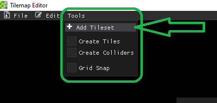

# Add Tilesets
To add more tilesets to your projects, go to the **Tools** menubar drop-down list and select 
<pre>

</pre>

This will open a file dialog that will allow you to choose your tileset. The supported image types are 
.png, .jpg, and .bmp

<pre>

</pre>

This will add the tileset to the loaded tilesets for that project. 
