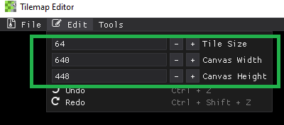

# Changing Canvas Size
You are able to change the canvas width and height by going to the **Edit** option in the menu bar. 

You can change the canvas size in increments based on the **Tile Size** by clicking on the -/+ buttons, or you can type in the size that you want. The smallest tile size that we can use is an [8x8] tile. 
