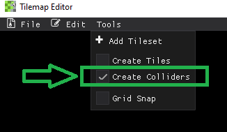
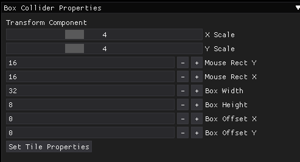
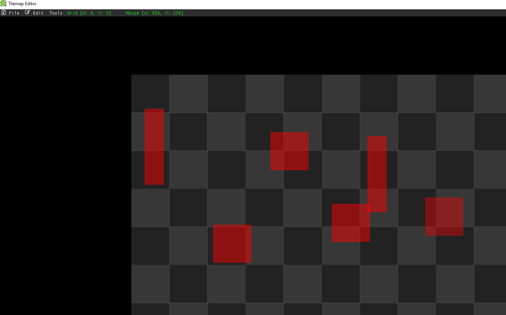

# Creating Box Colliders
There may come a case where you want to create separate box colliders that are not associated with any tiles. You can do this by checking the **Create Colliders** checkbox in the **Tools** menu.
<pre>

</pre>

Once selected, the **Box Collider Properties** Box will appear. In this you can set the size, scale, and your offsets.

The colliders that are created will be rendered on top of any tiles you may already have there and will be of a slightly transparent red box.

*Some randomly placed box colliders*
<pre>

</pre>  
Box Colliders are created and removed in the same way as when creating tiles. **Left Mouse Button** places a new collider. **Right Mouse Button** removes a collider. 