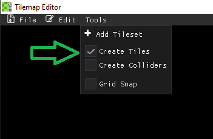

# Creating Tiles
To start creating tiles, you are going to want to have tilesets already added to the project before proceeding. See <u>**[Adding Tilesets](./adding_tilesets.md)**</u> for more information on adding tilesets.

Once you have at least one tileset added, go to the *Tools* menu and check the **Create Tiles** checkbox:

 

This will open up the create tiles window and allow you to select the desired tileset to use:

 

This will allow you to choose from all preloaded tilesets and will set the asset_id of the current tile to the name of the tileset. 
