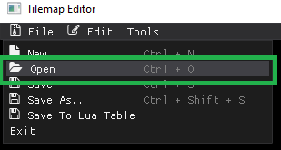
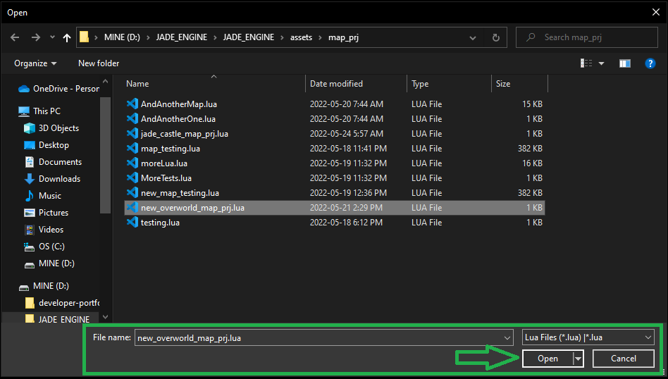
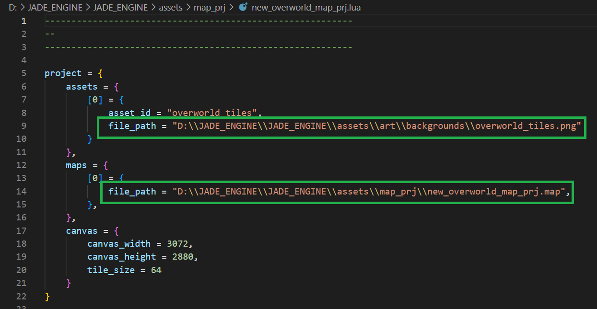

# Loading Your Projects
To load your already saved project, go to the **File** menu and select the **Open** menu item or hit the **Ctrl+O** key shortcut. 

This will open a Open File Dialog. Now all you have to do is search for your project, select it, and open your project:

This will read your saved project file and load all the tiles, assets (tilesets), and colliders from based on the saved *.map* files.

the tilesets are automatically loaded for that project, so you can just continue to work on your desired project.

*This is an example of a re-loaded map. It shows the pre-loaded tileset*

When loading a map, we must ensure that the path to the assets have not changed! If you load the project and no tile sprites are present. Open the project.lua file in your text editor of choice, and check to see if the path for the assets and .map files are correct.  

If the paths are not correct, change them accordingly and reload the map!
