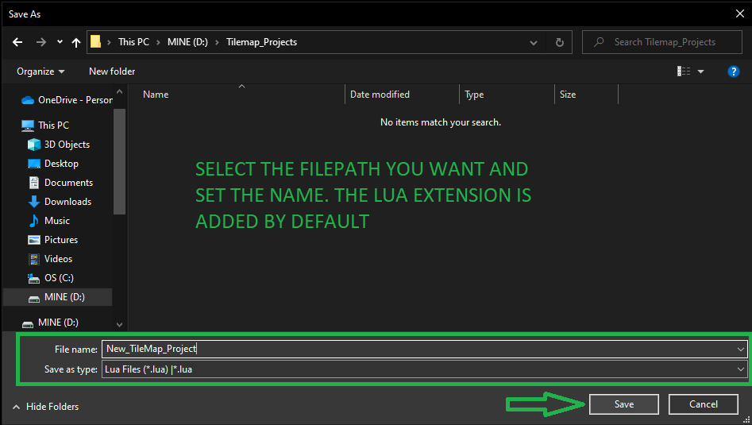
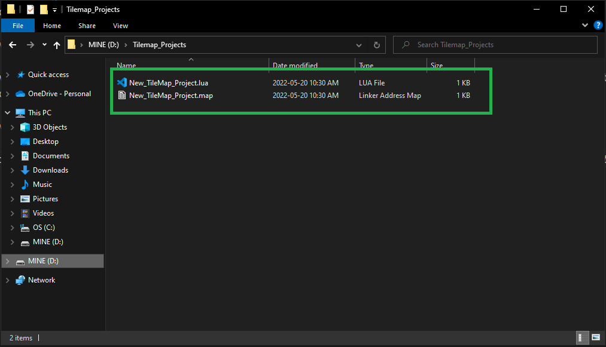
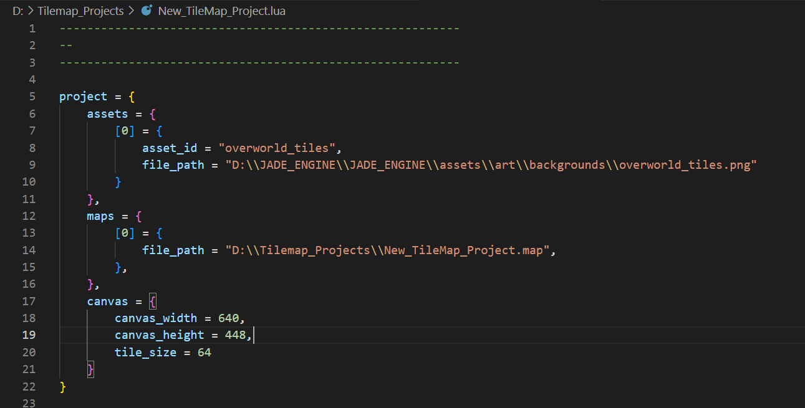

# Saving Your Projects
To save your project, go to the **File** menu and select either **Save** or **Save As...**: 

If you have not yet saved your project, a file dialog will open allowing you to choose the location that you want your project to be in. By default, the project is saved as a *.lua* file.

After saving there should be two files generated automatically for you (*three if colliders are created!*):

The *.lua* file is your project file. The project file contains a list of the assets, filepaths, and map paths to be used when loading a project and generating a tilemap. 

*Example of a saved project lua file!*

**As you can see from the example above, the lua file holds the specific paths of the assets and the maps; therefore, if you move the files to a different drive or location, you must update the path before you can properly load the project again. To change the path, simply open the *.lua* file in any text editor and change it to the new desired path.**
