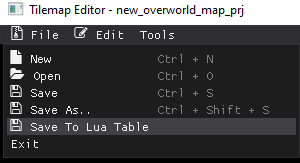

# Saving map to a Lua File

If you are using the JADE_ENGINE for creating a game, you can save the map to a formatted lua file! 

This will create a pre-formatted map that has the necessary tables needed for when loading a map in the JADE_ENGINE! 
If you have to source code, you can always change the saving to lua table to suit your own needs. 

*example of a lua table map file for the JADE_ENGINE*

