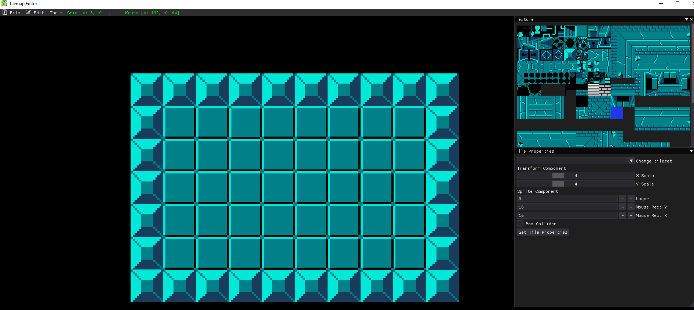

# Selecting a Tile

To select the desired tile to place just click on the image in the **Texture** box of the desired tile you want to use.

After selecting the tile, the tile will follow the mouse cursor. You are able to place the tile anywhere on the grid by pressing the **Left Mouse Button**. 

If you want to remove a tile, you can remove it by hovering over the you want to remove and press the **Right Mouse Button**. This will remove the tile from the registry. If you accidentally placed a tile, you can go to the edit menu and click the **Undo** or hit the keys **Ctrl + Z**.

By default, you can place the tiles anywhere on the grid with full control of where on the grid the tile is placed. If you want the tile to only be placed perfectly in each grid location without any overlap, go to the Tools menu and check the **Grid Snap** box.

The grid snap option automatically snaps the tile into the next grid location when moving the mouse around allowing for a cleaner look to the tiles; however, the free floating tile option is still there if you want to place tiles in a position that is not perfect to the grid.

*Example of using the grid snap option!*