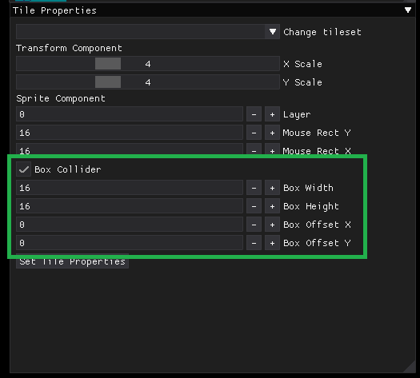
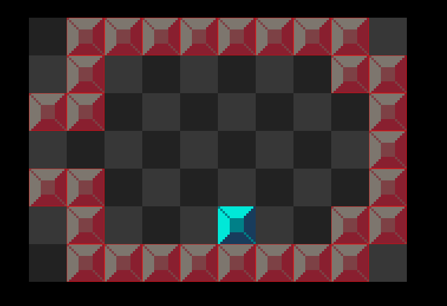

# Tile Properties
Each tiles has a list of properties that you are able to change from the editor. 
The properties are as follows:
- **Tile Scale** 
    - The scale property allows you to increase or decrease the scale of the tile in the x and y coordinates. So if you are using **[16x16] pixel** tiles, a scale of 4 would make them **[64x64] pixels** and so on.

- **Layer**
    - The layer property is your z-index of the tile. This is used by the render system to draw the tiles in ascending order. Therefore, if the first tiles layer is 0, the tile is rendered before any tile with a higher layer. The tiles with the higher layer value will be rendered on top. You do not have to create different layers in the editor, just set what layer you want the tile to be on and the render system handles the sorting.

- **Mouse Rect X/Y**
    - The mouse rect property allows you to select the size of the texture to parse. If the tiles are **[16x16] pixels** and you set the mouse rect to **[32x32] pixels**, the tile will be a set of **[2x2] tiles**: 
    
     

- **Box Collider**
    - The box collider property allows you to add a box collider component to the tile. To add a box collider you want to check the box collider checkbox. This will open up more properties to set the box collider. Those properties are as follows:
        - *width*: The desired width of the box collider
        - *height*: The desired height of the box collider
        - *offset x*: The **x** offset of the box collider from the tile origin [0,0]. (Top Left corner)
        - *offset y*: The **y** offset of the box collider from the tile origin [0,0]. (Top Left corner)

        
    
    - When the box colliders are selected, the tile wile be rendered with a red box surrounding it. This way you know what tiles are actually box colliders. 
    
   

